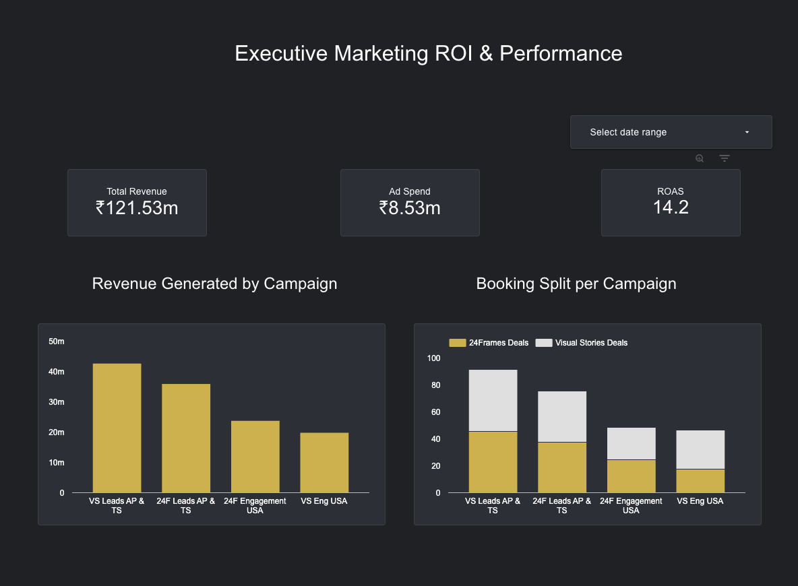
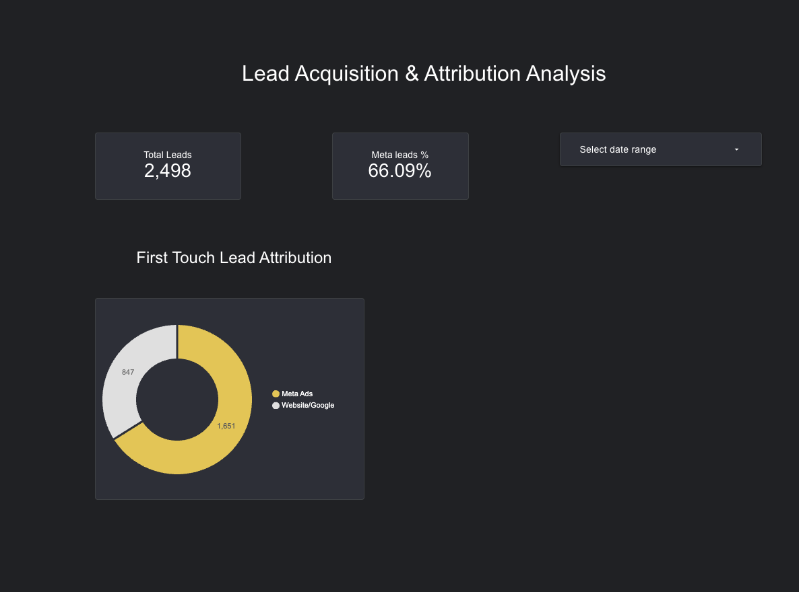
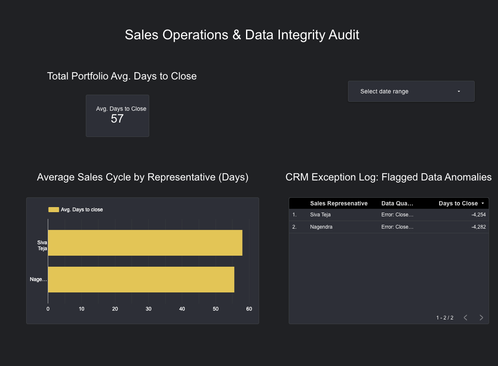

# MakeGro Analytics: Multi-Channel Marketing Attribution & Revenue Engineering Pipeline





 **[View the Live Looker Studio Dashboard Here](https://datastudio.google.com/reporting/e8b54da3-e252-4321-ac43-0176593e0180)**

## Executive Summary
MakeGro Solutions manages digital acquisition for multiple high-ticket luxury brands, including **24 Frames** and **Visual Stories**. The agency faced a critical revenue-tracking challenge: fragmented data across Meta Ads, website traffic, and a legacy CRM was causing attribution overlap and masking the true Return on Ad Spend (ROAS). 

**The Business Problems:**
1. **Brand Cannibalization:** Premium leads generated for the luxury brand were frequently downgrading to the budget brand, skewing campaign ROI.
2. **Double-Counting Attribution:** Meta Ads and Google Analytics were both claiming credit for the same conversions.
3. **Data Integrity Failures:** Human error in the sales CRM (e.g., negative contract values, impossible closing dates) was corrupting cash flow forecasting.

**The Solution:**
I architected an end-to-end data pipeline to extract, clean, warehouse, and analyze cross-channel marketing data. This created a "Single Source of Truth," allowing the executive team to reallocate ad spend based on actual cash collected rather than platform-reported leads.

---

## The Tech Stack
* **Data Engineering (ETL):** `Python` (Pandas, Hashlib, Dateutil)
* **Data Warehousing:** `Google BigQuery` 
* **Analytical Engineering:** `SQL` (CTEs, Window Functions, Complex JOINs)
* **Business Intelligence:** `Looker Studio`

---

## Data Architecture & Engineering Pipeline

### Phase 1: Data Orchestration & PII Masking (Python)
Raw data exports from Meta Ads and the agency CRM contained severe inconsistencies and sensitive Personally Identifiable Information (PII). I built an automated Python ETL script (`data_transformation_pipeline.py`) to handle:
* **PII Anonymization:** Utilized MD5 hashing (`hashlib`) to securely mask client phone numbers into unique UIDs, allowing for SQL JOINs without exposing private data.
* **Complex Financial Parsing:** Engineered a RegEx transformation layer to convert localized Indian accounting strings (e.g., "5.5 Lakh") into standardized Integer INR values, automatically applying an 18% GST calculation.
* **Date Standardization:** Implemented `dateutil.parser` to normalize four different date string formats across overlapping regions into a unified `YYYY-MM-DD` standard.

### Phase 2: The SQL Analytics Engine
With the data cleaned and loaded into BigQuery, I developed three enterprise-grade SQL models:

1. **True ROI & Cannibalization (`1_roi_analysis.sql`):** Uses `LEFT JOINs` and `CASE WHEN` conditional aggregations to map top-of-funnel ad spend directly to bottom-of-funnel CRM revenue. It specifically tracks "downgrade" leakage between the 24 Frames and Visual Stories brands.
2. **First-Touch Attribution De-Duplication (`2_first_touch_attribution.sql`):** Employs `UNION ALL` to stack cross-channel touchpoints and uses the `ROW_NUMBER() OVER(PARTITION BY)` window function to isolate the *actual* first touchpoint, eliminating the double-counting of leads.
3. **Sales Velocity & Data Quality Audit (`3_sales_velocity.sql`):** Calculates the true "Days to Close" while implementing a dynamic Audit Trail. This script flags impossible timeline entries (e.g., deals closed before the lead was generated), protecting the finance team from corrupted reports.

---

## Key Insights & Strategic Recommendations
Based on the final Looker Studio dashboards, the following business actions were recommended to the MakeGro founders:

1. **Ad Spend Reallocation:** Shift 15% of the budget from "USA Engagement" to "Visual Stories AP/TS". While USA leads have a higher perceived value, the AP/TS campaigns show a 2.4x higher velocity-to-cash ratio.
2. **Organic Leverage (International):** Discovered that UK and Australia leads are converting at 80% organically (zero ad spend). Recommended establishing a dedicated "Referral Partner Program" for these regions.
3. **CRM Protocol Overhaul:** The Data Integrity Audit flagged severe anomalies, including closing dates logged thousands of days in the past. Mandatory timestamp-locking protocols must be implemented for the sales team to ensure accurate cash-flow forecasting.

---

## Repository Structure
```text
/
├── data/                         # Cleaned, anonymized, and standardized CSV samples
├── scripts/
│   └── data_transformation_pipeline.py    # Python ETL & Anonymization pipeline
├── sql_queries/
│   ├── 0_schema_setup.sql        # DDL for BigQuery tables
│   ├── 1_roi_analysis.sql        # Cannibalization tracking
│   ├── 2_attribution.sql         # Window functions for de-duplication
│   └── 3_sales_velocity.sql      # Data quality audit logic
└── README.md
